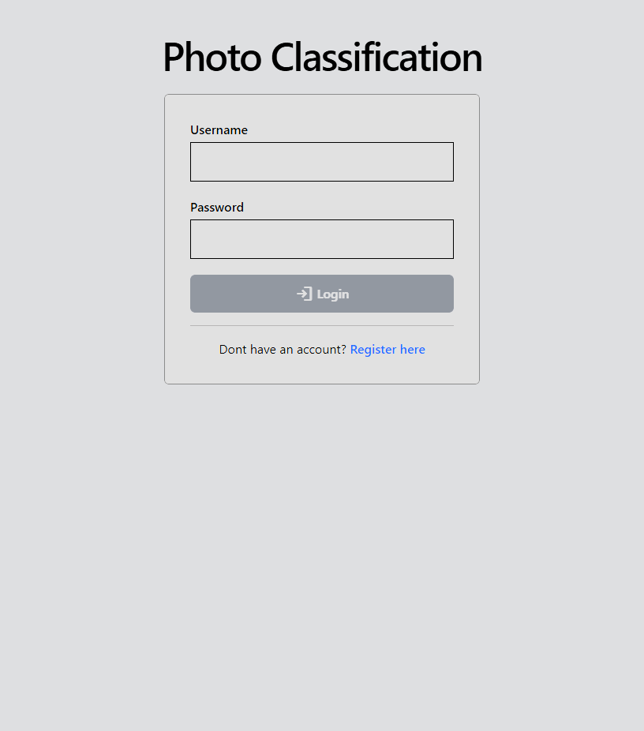
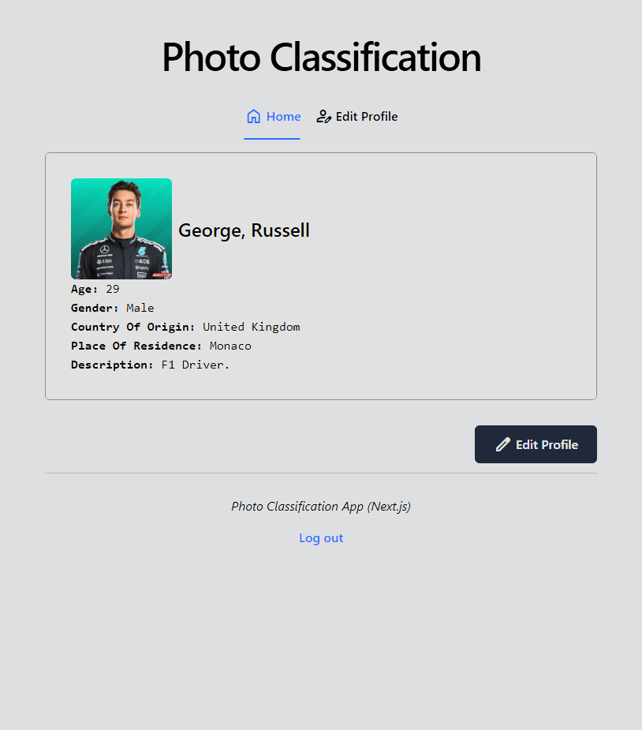
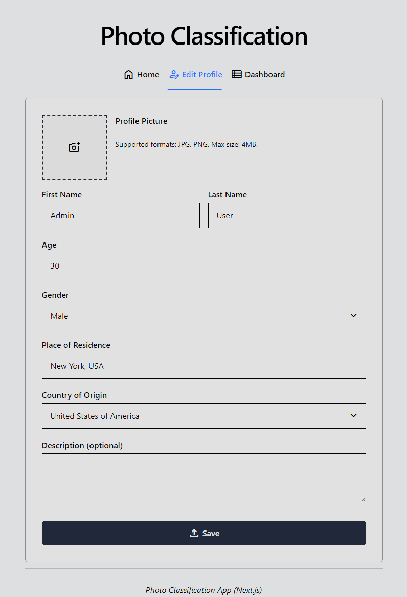
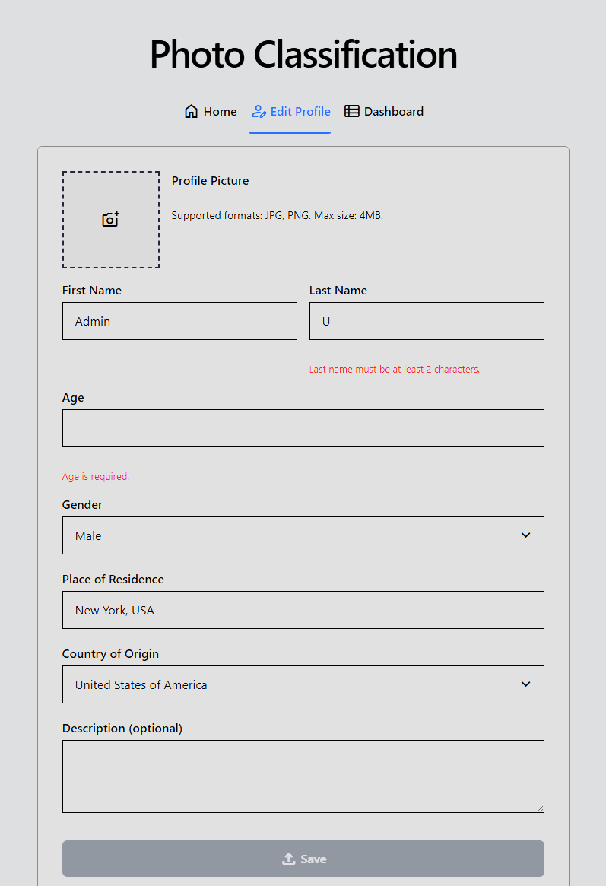
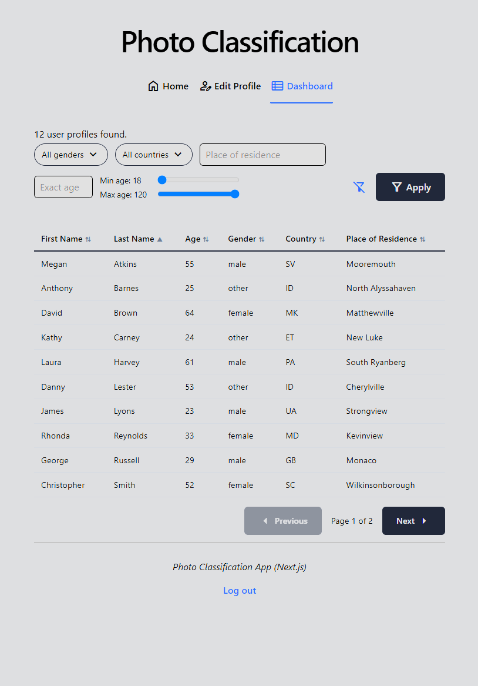
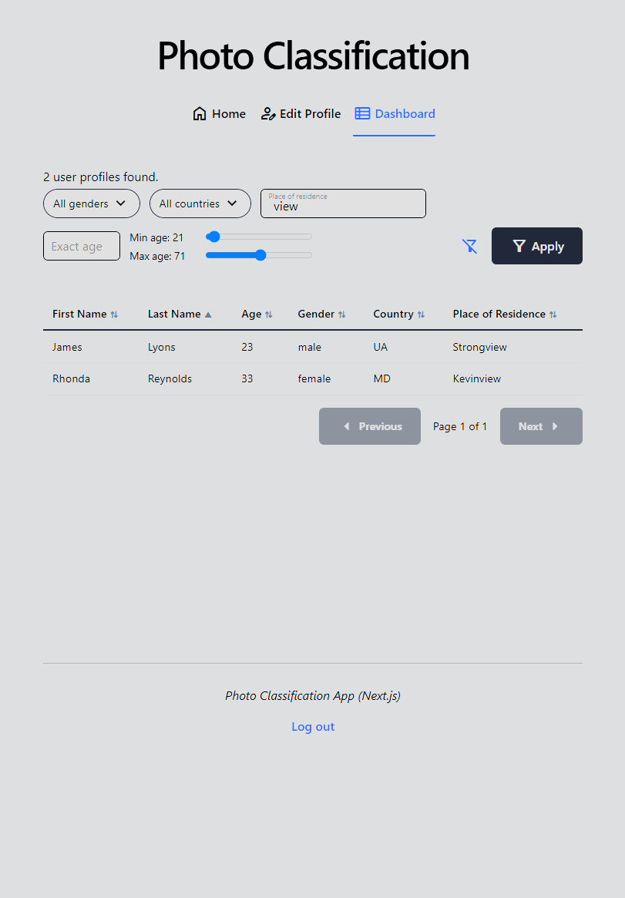
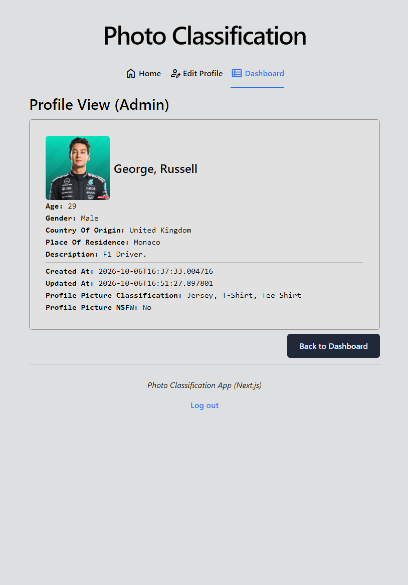

# Photo Classification - Frontend (Next.js)

"Photo Classification" is an experimental project to play around with a microservice architecture. Functionalities include:

- **Authentication:** users create an account with a username & password. Authentication is enabled via JSON web tokens (JWT).
- **Profile:** users can edit their profile via multiple fields, including first name, last name, age, gender, place of residence, country and an optional description.
- **Picture:** users can upload a picture to serve as their profile avatar.
- **Picture classification:** profile pictures are not immediately visible upon upload, but they must pass a NSFW classification check first. Should the picture be safe in that regard, it is subsequently classified in terms of its content and made visible on the frontend.
- **Administrator:** users with the role "admin" can access a dedicated dashboard page to view the full list of users, with a multitude of filters at their disposal.

The core logic and microservice architecture can be found in the backend server, which was developed with FastAPI and Docker. The backend is hosted in a separate repository: https://github.com/aryobarzan/photo_classification-fastapi

An alternate frontend was also developed for this same backend using Angular: https://github.com/aryobarzan/photo-classification-angular

## Getting Started

1. Start the backend (see its repository above).
2. Create a `.env` file in the project root:

```bash
# Base URL of the FastAPI backend, including the trailing slash
API_URL=http://localhost:8000/
# RSA public key (PEM) matching the private key the backend uses to sign JWTs
JWT_PUBLIC_KEY="-----BEGIN PUBLIC KEY-----
...
-----END PUBLIC KEY-----"
```

Both variables are required: the app throws on startup if either is missing.

3. Run the development server:

```bash
pnpm dev
# or
npm run dev
```

Afterwards, open [http://localhost:3000](http://localhost:3000) with your browser.

## Technical

This frontend project is written in TypeScript and makes use of various React and Next.js features.

### Routing & structure

- **App Router with route groups:** `(auth)` holds the public login/register pages, `(main)` holds the authenticated app (shared layout with navigation bar and footer).
- **Dynamic route:** `dashboard/profile/[user_id]` lets admins view the profile of an individual user.
- **Proxy:** `proxy.ts` places all routes of the app behind an authentication guard (JWT), except for the public `/login` and `/register` routes. Logged-in users are redirected away from those two pages.
- **Loading & errors:** `loading.tsx`, `error.tsx` and `not-found.tsx` for various routes to display dedicated views in case of in-progress loading and errors. `Suspense` is used to stream parts of the layout.
- **Client vs. server components:** files are marked as client components when they need hooks or browser APIs (`useState`, `react-hook-form`, `swr`), and remain server components otherwise. Modules that read environment values or call the backend are marked `server-only` or `"use server"`, so they can never end up in the client bundle.

### Authentication & security

- **Token validation:** JWT signature verification via public key (RS256) using the `jose` package, performed in `proxy.ts` before any request reaches the app. Server code afterwards only decodes the (already verified) token to read the username and role.
- **Token storage:** the JWT is stored as an `httpOnly`, `sameSite=lax` cookie (`secure` in production), so it is not readable from client-side JavaScript. The username and role are claims inside this token.
- **Role-based UI:** the navigation only shows the dashboard to admins. This is purely a UI convenience: the backend API is what enforces the admin role.
- **Authenticated API calls:** a single `apiFetch` helper attaches the bearer token to backend requests and redirects to `/login` on a 401.

### Data & forms

- **Schema validation:** `zod` package for schema definition and data parsing, both for form input and for validating responses from the backend.
- **Form validation:** `react-hook-form` for instant client-side validation, and `useActionState` to forward the validated data to server actions, which validate it again on the server.
- **Server actions:** login, registration, logout and profile saving (including the picture upload, with a raised body size limit of 5 MB) run as server actions. Saving a profile calls `revalidatePath` so the affected pages show fresh data.
- **Request memoization:** react's `cache()` deduplicates identical backend fetches within a single render pass (it does not persist data across requests).
- **URL-driven filters:** the admin dashboard stores its filters in the URL's `searchParams`, so applying a filter re-runs the server-side fetch, and filtered views are shareable. Sorting and pagination of the result table happen client-side with `useState` and `useMemo`.
- **Polling:** while a profile picture is being classified, the client polls its status via the `swr` package. It calls a Route Handler (`app/api/profile/picture-status`) that proxies the request to the backend, and stops polling once the status is no longer "processing".
- **State management:** `useState` for dynamic values and `useMemo` for dynamically computed values.
- **Countries:** `i18n-iso-countries` provides the list of countries for the profile form.

### Styling

- **Styling:** CSS styling via `globals.css`, locally scoped CSS modules and Tailwind CSS.
- **Fonts:** Geist via `next/font`.
- **Material icons:** Material Symbols fetched from `https://fonts.googleapis.com/`, limited to the icons the app uses.

## Screenshots

<details>
<summary>Login form</summary>



</details>

<details>
<summary>Home page (Logged in user's profile)</summary>



</details>

<details>
<summary>Profile editor form</summary>



</details>

<details>
<summary>Profile editor form (validation)</summary>



</details>

<details>
<summary>Dashboard for administrators</summary>



</details>

<details>
<summary>Dashboard with applied filters</summary>
The corresponding URL with the search params: http://localhost:3000/dashboard?min_age=21&max_age=71&place_of_residence=view



</details>

<details>
<summary>Profile view for administrator, including picture classification details</summary>



</details>
